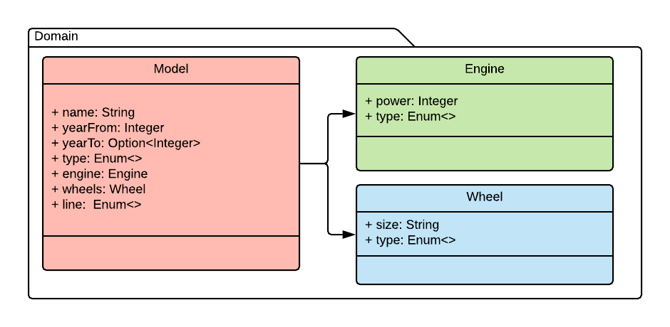
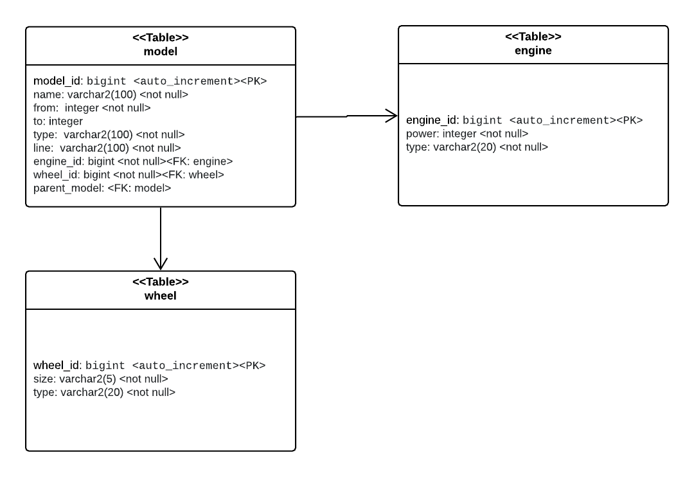

# Challenge answers

## A - The entities

#### - Model diagram
For clarification the arrows shown in the next diagram refers to owner composition from DDD perspective. For me is a lot easier and good enough to bring light over the proposed solution.

#### - Data diagram

## B - Ingest the data

For this part I think a cron job is not the best choice to create the initial scheme, because we only need to created once on the bootstrap of the app. For that reason I take advantage of the `ApplicationReadyEvent` 
which is fire as late as conceivably possible to indicate that the application is ready to service requests. 

I use `jackson-xml` to parse the document and create an `ACL` to parse the entities to the model ones. 

## C - Expose data with a RESTful 

For this part was added an RestController to integrated what was build before.

The app now exposes two REST endpoints:

    1. http://localhost:8080/brand?brand=Bronco. Retrieves a list of Car Model by brand.
    
    2. http://localhost:8080/model?id=10. Get a model by id.

## D - Adding images

For this part I would use some service like [Amazon S3](https://aws.amazon.com/es/s3/) to save the images and persist the id(s) reference(s) on my DB.
For serving the images I'd generate a public URL and return it with the Model info.

## E - Improvements

Despite I had not worked with Spring for several years I don't have nothing to say. The app is quite simple and the challenges were clear enough.

It would be better to discuss the decision making.

#### Tests

For test purposes some unit tests were omitted, mainly because due of the simplicity of the app unit-testing the Service 
or the Controller is unit-testing Spring itself. Instead of that I rely on integration tests to QA the code, where having a
memory DB is a better approach. 
