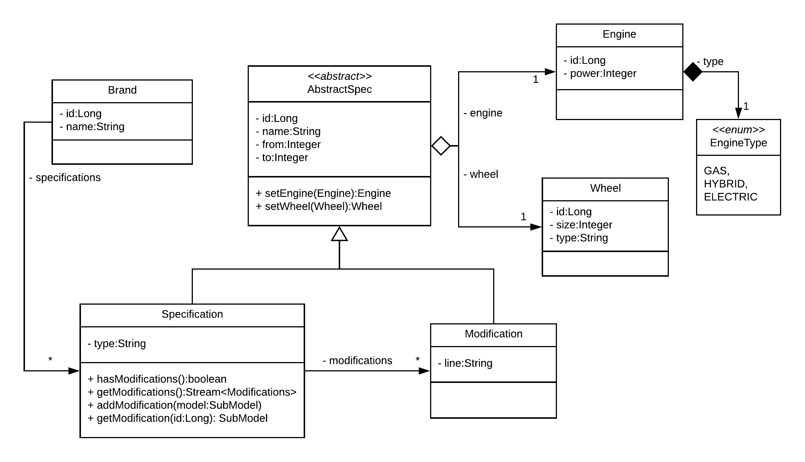
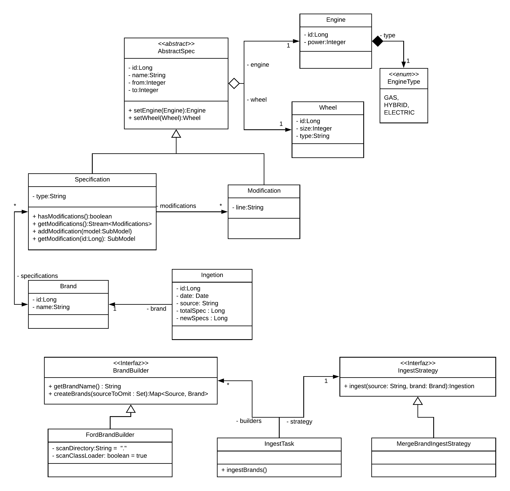

# Challenge answers

## A - The entities

Below a short explanation about the decision taken regarding domain model design. 



### Brand

The service will support model specifications from several brands/factories and each of these brands will have a 
unique list of car specifications that they sell.  

Each `Brand` will contain a `name` and their list of `Specification`s. 

### Specification and Modification
Based on the car models structure and data provided into the sample file, I've identified a hierarchy of entities based 
on commons attributes as `name`, `Engine` and `Wheel`.  

An `Specification`s represent the base setup for a set of `Modifications`s that define small variants from the 
original spec.

> *NOTE : Some decisions were taken with the goal of design a normalized Domain Model and use some advance technics as
> using hierarchies and JPA, but if the domain model is so simple as the sample data, maybe a unique `Specification` 
>entity containing all the data is much simpler for maintenance.*   

### Engine

Based on the provided sample data the same `Engine` information could be used on several `Specifications`, so I've 
decided to create just one engine per _power:type_ tuple. This means that many `Specification` instances could be pointed to 
the same `Engine` if `power` and `type` attributes are equals.  

Also, I've modeled `EngineType` as an _Enum_. The pros are that this simplifies the string typos and keeps integrity in 
the domain model. The cons are that every time that a new engine type appears, a new version of the service must be 
deployed. An improvement is to transform this _Enum_ in a _Value Object_ list stored into the DataBase.

### Wheel

I've taken similar decisions for `Wheel` entities. They are unique id _size:type_ tuple is equaled.
In this case, I keep the type as a `String` 

### Ingestion
This entity is used to maintain a history of each `Brand`'s ingestion, registering the source, the ingestion date, 
and the `Specifications` processed and added during the process.  
This also allows checking the duplicated ingestion of the same source.

 
## B - Ingest the data
The ingestion process is designed and implemented to accomplish with the next definitions:

* Factories will only send catalogs for a single Brand
* Factories will send monthly files that should be ingested
* The same file should not be ingested twice but two different files from the same factory could contain the same
 car model
* If the model was not previously ingested, this will be created based on the data source
* If the model was previously ingested, will be replaced with the new model specification
* The same strategy will be applied to all the different brands and the data source provided 



### Entities and Repositories - JPA

All the _Domain Model_'s entities were annotated using JPA and the corresponding _Repository_ was implemented to keep 
this complete model persistent.

### Brand Builder
_Factory Method_ that creates `Specification` for each car model providedfor a single `Brand`, parsing and adapting 
specific data sources (e.g. XML files, JSON files, web services, etc).  

A `FordBrandBuilder` was implemented to parse XML files provided from Ford brand and create the 
corresponding cars `Specification`.

A new `BrandBuilder` instance could be added into the `BuildersConfigurations` and the generated `Brand` will be 
ingested using the same `IngestStrategy` for all of them.

### Ingest Strategy
`IngestStrategy` implement the strategy to ingest new or existant `Brand`s and `Specificatio`s.  

A `MergeBrandsIngestStrategy` was implemented to follow this definition:  
* If the model's `Specification` was not previously ingested, this will be created based on the data source  
* If the  model's `Specification` was previously ingested, will be replaced with the new model specification  

## C - Expose data with a RESTful API

For this project, I've enabled _Spring Data Web_ allowing to publish Repositories automatically with **HATEOS** support.

I will take advantage of this to expose the repositories of `Brand`s and `Specification`s 
which allow accomplishing the next two requirements:

### Basic Endpoints
* Get a car specification by id
```curl GET http://localhost:8080/specifications/{id}```

* Get all the car specifications by brand  
```curl GET http://localhost:8080/specifications/search/findByBrandName?brand=Ford```

### Spring Data Web Endpoints

_Spring Data Web_ also will enable some endpoints that allow accessing `Brand`s and `Specification`s as for example:  

* Find `Specification`'s by name - `curl GET http://localhost:8080/specifications/search/findByName?name=Ford%20Fiesta`
* Get all `Specification`'s by `Brand`'s id - `http://localhost:8080/brands/1/specifications`

## D - Adding images

### Domain Model
In order to support attach images to each car's `Specification` I've added to the domain model the `Image` entity
which contains the `data` (bytes) of the images and information extra information as `fileName` and `fileType`.

Each `Specification` has a unique `Image` associated.

### Service and Repository

A `ImageService` was implemented in order to manage storage access to the image entity associated to each 
`Specification`, and an `AbstractSpecRepository` was implemented to allows associating images to both car's 
`Specification`s and `Modification`s.

### Image's endpoints

The RESTFull API of the `Specification` entity was modified adding access to the `Image`s. This two endpoint are:

* `curl -X POST http://localhost:8080/specifications/{SpecificationId}/image -H 'content-type: multipart/form-data' 
-F file=@{local-path}`

* `curl -X GET http://localhost:8080/specifications/{SpecificationId}/image` 

## E - Improvements

Here a list of TODOs for improving the solution in order to deploy it in a production environment:

Functional improvements
* Improve `IngestionStrategy` in order to not duplicate `Engine`s and `Wheel`s
* Add some sample `BrandBuilder` to generate `Brand`s from different data sources, as e.g. RestAPIs.
* Including _Integration Test_ for the main endpoints

Non-functional improvements
* Add _Spring Boot Actuator_ to add production-ready features **[Done]**
  - Implement custom _HealthIndicator_ for monitor `Ingestion`s **[Todo]**
* Add Spring profiles for _development (dev)_ and _Production (prod)_ environment **[Done]**
* Add _Spring Security_ to add authentication and authorization to the service **[Todo]**
* Add _Swagger_ documentation **[Todo]**
* _Docker_ support  **[Todo]**
