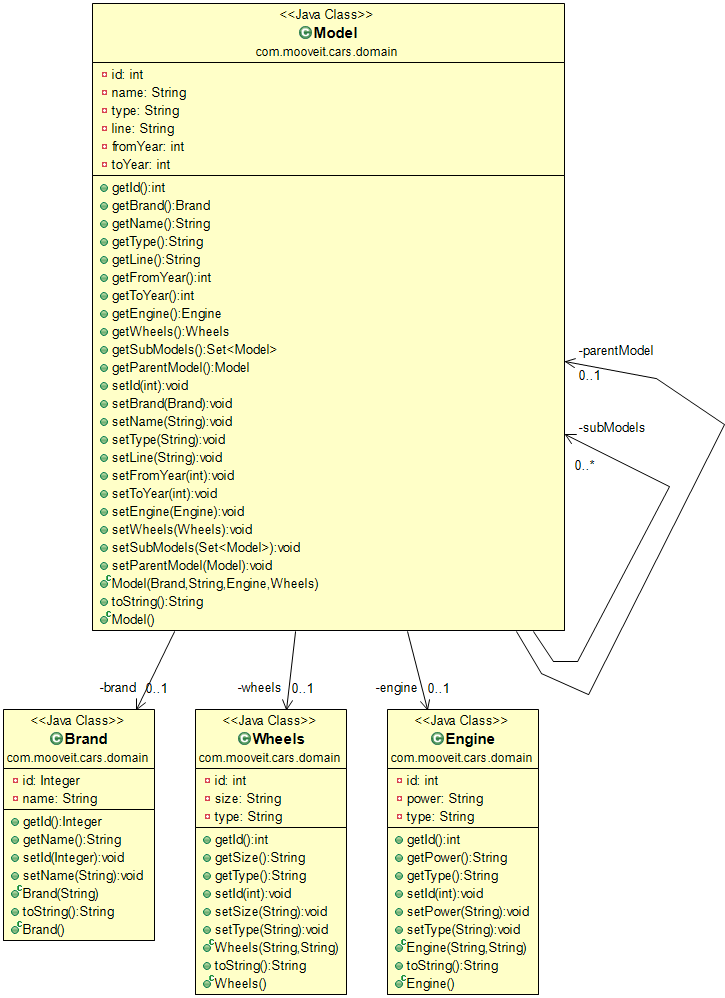

# Challenge answers
I use Spring Tool Suite v4.4.4.1

## A - The entities
No need to define DDL (Data Definition Code), All was JPA defined.
### UML Class Diagram
The diagram was constructed directly from Java Sources using <a href="www.objectaid.com" target="_blank">ObjectAid UML Explorer</a>


## B - Ingest the data

I constructed the following Class to extract XML:
* *com.mooveit.cars.utils.HandlerXMLFord*

And some unit test's:
* *com.mooveit.cars.testLoadingFord*

## C - Expose data with a RESTful API

The only special thing to say is that I needed to put **@JsonIgnore** annotation over the subModels element on **Models** Entity to prevent cyclic situation on RESTFUL output.

Test URL's:

* Get a car specification by id

<a href="http://127.0.0.1:8080/models/2" target="_blank">http://127.0.0.1:8080/models/2</a>

* Get all the car specifications by brand
 
<a href="http://127.0.0.1:8080/models?brandname=ford" target="_blank">http://127.0.0.1:8080/models?brandname=ford</a>

 
## D - Adding images

Add the following into the Model Entity:

```java
@Lob  
private byte[] photo;
```

so now we have a BLOB type column on Model table.

We need to put the photos of each Model with the following file name pattern: {model name}.jpg (or .png) in a fixed folder. 

In the processing of the Models Specification Input file (ford-example.xml) we try to read the photo using the model name. If it exists we load into a byte array and assign it to 'photo' variable.

As I know a byte array is converted to a 'base64' string when it's passed to a RESTFUL webservice.

That's all.

## E - Improvements

This morning I wake up thinking about improvements, reviewing the code I find 'Hard Code'. For example the xml with the Ford models description. This must go out of the code. An alternative can be send that to a .properties file or better, to a configurable DB table.

